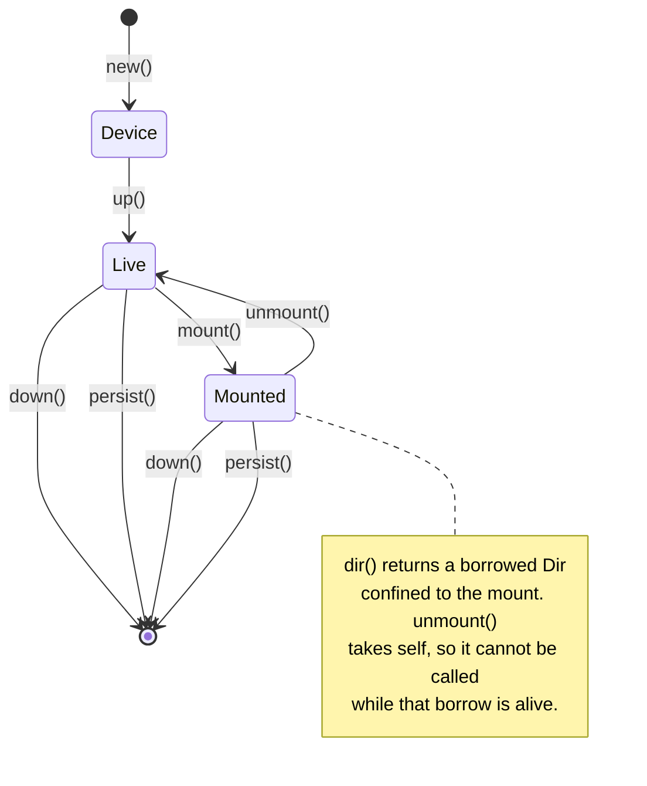

# obd-rs

Drive [overlaybd](https://github.com/containerd/overlaybd) block devices from
Rust: create layers, launch a device over TCMU and configfs, mount it, commit
the result, tear it down.

Two constraints shaped the design:

- **Untrusted code touches the mount.** A mounted device hands back a
  [`cap_std::fs::Dir`](https://docs.rs/cap-std), so whatever is given that
  handle cannot walk out of the mount.
- **The lifecycle has ordering rules that are easy to get wrong.** They are
  encoded as a typestate, so violating the important one is a compile error
  rather than an `EBUSY` at runtime.



## Quick start

```bash
sudo ./scripts/install-overlaybd.sh   # install, /opt/overlaybd wiring, baselayer
cargo build
sudo ./target/debug/obdctl preflight
```

```rust
use obd::{Device, DeviceConfig, Lower, Mode, tools};

tools::create_sparse_layer("/var/lib/x/u.data".as_ref(), "/var/lib/x/u.index".as_ref(), 64)?;

let config = DeviceConfig::new("/var/lib/x/result-a")
    .lower(Lower::file(tools::DEFAULT_BASELAYER))
    .upper("/var/lib/x/u.data", "/var/lib/x/u.index");

let device  = Device::from_config("poc_a", &config, "/var/lib/x/device-a.json", "0021")?;
let mounted = device.up()?.mount("/mnt/obd-a", Mode::Rw)?;

let out = mounted.create_subdir("job-out")?;   // sandboxed handle
out.write("result.json", b"{}")?;
drop(out);                                     // borrow must end before unmount

mounted.unmount()?.down()?;

tools::commit_layer(
    "/var/lib/x/u.data".as_ref(),
    "/var/lib/x/u.index".as_ref(),
    "/var/lib/x/job.commit".as_ref(),
    "job 1",
)?;
```

## Sandboxing scope

`Mounted::dir` and `Mounted::create_subdir` return handles confined to the
mount: `..` and absolute paths are refused.

| Plane | Confined | Why |
| --- | --- | --- |
| Data: the contents of the mount | Yes | cap-std resolves every path relative to a directory file descriptor |
| Control: configfs, `mount(2)`, the `overlaybd-*` binaries | No | Ambient, root-only, whole-host operations that no capability system confines |

## `obdctl`

| Command | Purpose |
| --- | --- |
| `preflight` | Report whether this host can drive devices; non-zero exit if not |
| `layer create --data D --index I --size-gb 64` | Create a sparse writable layer |
| `layer commit --data D --index I --out O --message M` | Commit a writable layer into a read-only one |
| `config --out C --result-file R --lower L [--upper-data D --upper-index I]` | Write a device config |
| `config ... --remote-lower sha256:abc=167936 --repo-blob-url URL` | Add a streamed lower |
| `device up --name poc_a --config C --result-file R --naa-suffix 0021 [--mount P] [--read-only] [--subdir S]` | Launch, optionally mount, and leave running |
| `device down --name poc_a --naa-suffix 0021 [--mount P]` | Unmount and tear down |
| `cleanup [--mount A --mount B]` | Remove leftovers from an interrupted run |

`--json` makes any command machine-readable on stdout:

```console
$ obdctl --json device up --name poc_a --config c.json --result-file r \
    --naa-suffix 0021 --mount /mnt/obd-a --subdir job-out
{
  "name": "poc_a",
  "naa_suffix": "0021",
  "block_device": "/dev/sda",
  "mountpoint": "/mnt/obd-a"
}
```

### Commands are stateless, and `device up` leaves the device running

A device is identified by its name and nexus suffix, both caller-chosen, so
`device up` and `device down` in separate processes need no state file.

The library tears devices down through `Drop`. `device up` calls `persist` to
defuse that: the CLI process exits immediately afterwards, and without it
`obdctl device up` would destroy the device it had just created. Library code
that must outlive its handle needs the same call.

## Diagnostics

The library emits [`tracing`](https://docs.rs/tracing) events and installs no
subscriber, so it costs nothing until a binary opts in. `obdctl` installs one,
plus [`color-eyre`](https://docs.rs/color-eyre).

| Level | Purpose | Sites |
| --- | --- | --- |
| `error` | Non-recoverable failures, especially syscall edges needing remediation outside the process | `mount(2)` failed, configfs rejected a write, no block device appeared |
| `warn` | Defensive code that fired | EAGAIN retry covered for a daemon still attaching, unmount retried while busy, a recycled device node skipped, teardown from `Drop` |
| `info` | Audit trail | Every layer, config, device and mount created, modified or removed |
| `debug` | Flow and state transitions | Binary discovery, each configfs write, each teardown step |
| `trace` | Timing and counts | `configfs-write`, `result-file`, `node-resolved`, `unmount`, `device-up` |

`info` on its own is a complete record of what the crate did to the host.

```console
$ obdctl device up --name poc_a --config d.json --result-file r --naa-suffix 0021 --mount /mnt/obd-a
 INFO obdctl::device: launched an overlaybd device device=poc_a block_device=/dev/sda naa=naa.5001405e0b0d0021 scsi_address=0:0:1
 INFO obdctl::device: mounted an overlaybd device mountpoint=/mnt/obd-a mode=rw
```

`-v` selects debug and `-vv` trace; `RUST_LOG` overrides both. Traces are
concentrated in `obd::configfs`, so every wait in the lifecycle can be measured
without enabling anything else:

```console
$ RUST_LOG=obd::configfs=trace obdctl device up ...
TRACE configfs-write attempts=1 elapsed_us=1126
TRACE result-file polls=1 elapsed_ms=0
TRACE resolve_block_device{device=poc_a naa=naa.5001405e0b0d0021}: node-resolved polls=2 recycled=0 not_ready=0 elapsed_ms=206
```

Failures arrive as a color-eyre report carrying the context chain, the location
and the span trace:

```console
$ obdctl layer commit --data missing.data --index missing.index --out out.commit
Error:
   0: committing missing.data into the read-only layer out.commit
   1: overlaybd binary `overlaybd-commit` not found in [...]; run scripts/install-overlaybd.sh, or set OVERLAYBD_BIN_DIR

Location:
   src/bin/obdctl.rs:311

  ━━━━━━━━━━━━━━━━━━━━━━━━━━━━━━━━━━ SPANTRACE ━━━━━━━━━━━━━━━━━━━━━━━━━━━━━━━━━━━
   0: obdctl::obdctl::layer
      at src/bin/obdctl.rs:276
```

`RUST_BACKTRACE=1` adds the backtrace and `RUST_BACKTRACE=full` adds source
snippets. Logs go to stderr, keeping `--json` on stdout parseable.

The library returns typed [`thiserror`](https://docs.rs/thiserror) errors.
color-eyre, tracing-subscriber, tracing-error and clap sit behind the
default-on `cli` feature, so `--no-default-features` pulls in none of them:
choosing a report handler belongs to the binary.

## Layout

| Path | Purpose |
| --- | --- |
| `src/lib.rs` | Public API, `preflight` |
| `src/device.rs` | The `Device` → `Live` → `Mounted` typestate |
| `src/configfs.rs` | Backstore, nexus and LUN choreography; block-device resolution |
| `src/config.rs` | Device config JSON; local and streamed lowers |
| `src/tools.rs` | `overlaybd-create` and `overlaybd-commit`; binary discovery |
| `src/cleanup.rs` | Convention sweep, signal handling |
| `src/bin/obdctl.rs` | The CLI, the subscriber and the color-eyre setup |
| `build.rs` | Build-time probe; warns only |
| `scripts/install-overlaybd.sh` | Install and layout wiring |
| `tests/api.rs` | Runs anywhere, including macOS |
| `tests/linux_device.rs` | Library device lifecycle; Linux and root |
| `tests/lima-e2e.sh` | `obdctl` device lifecycle; Linux and root |
| `lima-dev.yaml` | Lima VM for developing from macOS |

## Installation

The `containerd-overlaybd` package on packages.microsoft.com installs binaries
under `/usr/bin/overlaybd` and ships nothing else: no
`/etc/overlaybd/overlaybd.json`, no `cred.json`, no `ext4_64` baselayer. Its
systemd unit hardcodes `ExecStart=/opt/overlaybd/bin/overlaybd-tcmu`, so a stock
install fails with `status=203/EXEC`.

`scripts/install-overlaybd.sh` reconciles that: it symlinks the binaries into
`/opt/overlaybd/bin`, seeds the two config files, and fetches the baselayer from
the overlaybd source tree, where it is a checked-in artifact rather than a build
output.

`build.rs` only warns when those binaries are absent. The build host and the run
host need not be the same machine, so a hard failure would break `cargo check`,
`clippy` and rust-analyzer on any machine without overlaybd installed.
`obdctl preflight` is the authoritative check.

## Platform

configfs, TCMU and `mount(2)` are Linux-only. The types compile everywhere so
the crate can be developed and unit-tested on macOS; device operations return
`Error::UnsupportedPlatform` off Linux.

## Testing

```bash
cargo test                                  # anywhere, including macOS

limactl start --name=obd-dev --mount "$PWD" ./lima-dev.yaml
limactl shell obd-dev
sudo ./scripts/install-overlaybd.sh

sudo -E OBD_DEVICE_TESTS=1 cargo test --test linux_device -- --test-threads=1
cargo build && sudo ./tests/lima-e2e.sh
```

overlaybd is architecture independent, so the Lima VM works on Apple Silicon.

The two device suites are not redundant. `tests/lima-e2e.sh` drives `obdctl`,
which always hands devices off with `persist`; `tests/linux_device.rs` drives
the library, the only way to reach the RAII paths — an explicit `down`, and
teardown from `Drop`. Both mutate global host state, hence `--test-threads=1`,
and the library suite skips unless `OBD_DEVICE_TESTS` is set so a plain
`cargo test` stays green anywhere.

Between them they cover launching a device, mounting it, writing through the
sandboxed handle, committing, restacking the committed layer read-only,
asserting the read-only mount refuses writes, back-to-back reruns that exercise
the `tcm_loop` SCSI-triple recycling waits, and an idempotent cleanup that
leaves no configfs entries behind.

## Ordering rules

Getting any of these wrong produces a confusing failure. The first is enforced
by the compiler; the rest at runtime.

1. **Drop every handle on the mount before unmounting.** An open descriptor is
   what makes `umount` return `EBUSY`. `Mounted::dir` borrows and
   `Mounted::unmount` consumes `self`, so this cannot compile wrong.
2. **Never point a job's output at the mount root.** A consumer that wipes its
   output directory would take `lost+found` with it. Use `create_subdir`.
3. **sync, unmount, tear down, then commit.** `overlaybd-commit` opens the data
   file `O_RDWR` and will capture a torn filesystem from a device the daemon
   still has open.
4. **Mount a lower-only device `ro,noload`.** Its layers are all read-only, so
   ext4 cannot replay a journal. `Mode::Ro` does this.
5. **configfs teardown is order sensitive**: LUN symlink → `lun_0` → `tpgt_1` →
   `naa.*` → backstore → HBA.
6. **Check `resultFile` after enabling a device.** overlaybd reports launch
   failures there rather than through the configfs write.
7. **Never hardcode `/dev/sdX`.** It is resolved from the loopback nexus.
   `tcm_loop` recycles SCSI triples, so resolution waits for the node's `dev_t`
   to match sysfs and for the node to be readable, and teardown waits for the
   old device to disappear.
8. **`overlaybd-create` refuses to overwrite.** Its outputs are opened
   `O_EXCL|O_CREAT`, so each run needs a fresh directory.

## Scope

Registry operations — push, pull, login — are out of scope. `Lower::remote` and
`DeviceConfig::repo_blob_url` describe a streamed layer so a device can consume
one, but publishing a blob and authenticating to a registry live elsewhere.
