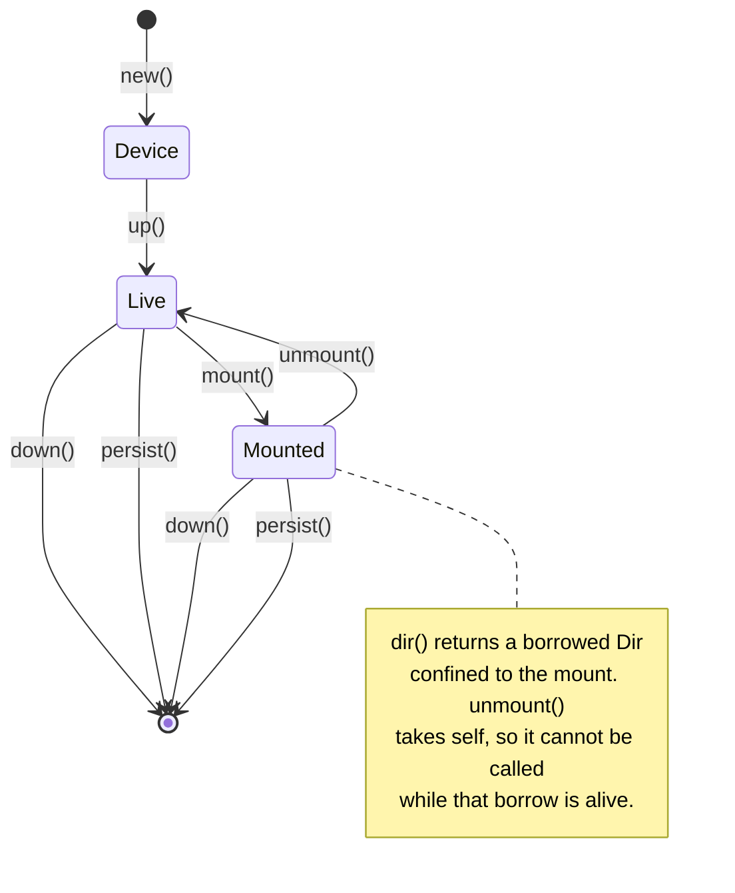

# obd-rs

Drive [overlaybd](https://github.com/containerd/overlaybd) block devices from
Rust: create layers, launch a device over TCMU and configfs, mount it, commit
the result, tear it down.

Two constraints shaped the design:

- **Untrusted code touches the mount.** A mounted device hands back a
  [`cap_std::fs::Dir`](https://docs.rs/cap-std), so whatever is given that
  handle cannot walk out of the mount.
- **The lifecycle has ordering rules that are easy to get wrong.** They are
  encoded as a typestate, so violating the important one is a compile error
  rather than an `EBUSY` at runtime.



## Quick start

```bash
make quickstart
```

That installs overlaybd with its `/opt/overlaybd` wiring and baselayer, builds,
and reports whether this host can drive devices. On Linux it runs in place and
escalates with sudo where it must; anywhere else it runs in the devcontainer.
`make help` names which.

```rust
use obd::{Device, DeviceConfig, Lower, Mode, tools};

tools::create_sparse_layer("/var/lib/x/u.data".as_ref(), "/var/lib/x/u.index".as_ref(), 64)?;

let config = DeviceConfig::new("/var/lib/x/result-a")
    .lower(Lower::file(tools::DEFAULT_BASELAYER))
    .upper("/var/lib/x/u.data", "/var/lib/x/u.index");

let device  = Device::from_config("poc_a", &config, "/var/lib/x/device-a.json", "0021")?;
let mounted = device.up()?.mount("/mnt/obd-a", Mode::Rw)?;

let out = mounted.create_subdir("job-out")?;   // sandboxed handle
out.write("result.json", b"{}")?;
drop(out);                                     // borrow must end before unmount

mounted.unmount()?.down()?;

tools::commit_layer(
    "/var/lib/x/u.data".as_ref(),
    "/var/lib/x/u.index".as_ref(),
    "/var/lib/x/job.commit".as_ref(),
    "job 1",
)?;
```

## Sandboxing scope

`Mounted::dir` and `Mounted::create_subdir` return handles confined to the
mount: `..` and absolute paths are refused.

| Plane | Confined | Why |
| --- | --- | --- |
| Data: the contents of the mount | Yes | cap-std resolves every path relative to a directory file descriptor |
| Control: configfs, `mount(2)`, the `overlaybd-*` binaries | No | Ambient, root-only, whole-host operations that no capability system confines |

## `obdctl`

| Command | Purpose |
| --- | --- |
| `preflight` | Report whether this host can drive devices; non-zero exit if not |
| `layer create --data D --index I --size-gb 64` | Create a sparse writable layer |
| `layer commit --data D --index I --out O --message M` | Commit a writable layer into a read-only one |
| `config --out C --result-file R --lower L [--upper-data D --upper-index I]` | Write a device config |
| `config ... --remote-lower sha256:abc=167936 --repo-blob-url URL` | Add a streamed lower |
| `device up --name poc_a --config C --result-file R --naa-suffix 0021 [--mount P] [--read-only] [--subdir S]` | Launch, optionally mount, and leave running |
| `device down --name poc_a --naa-suffix 0021 [--mount P]` | Unmount and tear down |
| `cleanup [--mount A --mount B]` | Remove leftovers from an interrupted run |

`--json` makes any command machine-readable on stdout:

```console
$ obdctl --json device up --name poc_a --config c.json --result-file r \
    --naa-suffix 0021 --mount /mnt/obd-a --subdir job-out
{
  "name": "poc_a",
  "naa_suffix": "0021",
  "block_device": "/dev/sda",
  "mountpoint": "/mnt/obd-a"
}
```

### Commands are stateless, and `device up` leaves the device running

A device is identified by its name and nexus suffix, both caller-chosen, so
`device up` and `device down` in separate processes need no state file.

The library tears devices down through `Drop`. `device up` calls `persist` to
defuse that: the CLI process exits immediately afterwards, and without it
`obdctl device up` would destroy the device it had just created. Library code
that must outlive its handle needs the same call.

## Diagnostics

The library emits [`tracing`](https://docs.rs/tracing) events and installs no
subscriber, so it costs nothing until a binary opts in. `obdctl` installs one,
plus [`color-eyre`](https://docs.rs/color-eyre).

| Level | Purpose | Sites |
| --- | --- | --- |
| `error` | Non-recoverable failures, especially syscall edges needing remediation outside the process | `mount(2)` failed, configfs rejected a write, no block device appeared |
| `warn` | Defensive code that fired | EAGAIN retry covered for a daemon still attaching, unmount retried while busy, a recycled device node skipped, teardown from `Drop` |
| `info` | Audit trail | Every layer, config, device and mount created, modified or removed |
| `debug` | Flow and state transitions | Binary discovery, each configfs write, each teardown step |
| `trace` | Timing and counts | `configfs-write`, `result-file`, `node-resolved`, `unmount`, `device-up` |

`info` on its own is a complete record of what the crate did to the host.

```console
$ obdctl device up --name poc_a --config d.json --result-file r --naa-suffix 0021 --mount /mnt/obd-a
 INFO obdctl::device: launched an overlaybd device device=poc_a block_device=/dev/sda naa=naa.5001405e0b0d0021 scsi_address=0:0:1
 INFO obdctl::device: mounted an overlaybd device mountpoint=/mnt/obd-a mode=rw
```

`-v` selects debug and `-vv` trace; `RUST_LOG` overrides both. Traces are
concentrated in `obd::configfs`, so every wait in the lifecycle can be measured
without enabling anything else:

```console
$ RUST_LOG=obd::configfs=trace obdctl device up ...
TRACE configfs-write attempts=1 elapsed_us=1126
TRACE result-file polls=1 elapsed_ms=0
TRACE resolve_block_device{device=poc_a naa=naa.5001405e0b0d0021}: node-resolved polls=2 recycled=0 not_ready=0 elapsed_ms=206
```

Failures arrive as a color-eyre report carrying the context chain, the location
and the span trace:

```console
$ obdctl layer commit --data missing.data --index missing.index --out out.commit
Error:
   0: committing missing.data into the read-only layer out.commit
   1: overlaybd binary `overlaybd-commit` not found in [...]; run scripts/install-overlaybd.sh, or set OVERLAYBD_BIN_DIR

Location:
   src/bin/obdctl.rs:311

  ━━━━━━━━━━━━━━━━━━━━━━━━━━━━━━━━━━ SPANTRACE ━━━━━━━━━━━━━━━━━━━━━━━━━━━━━━━━━━━
   0: obdctl::obdctl::layer
      at src/bin/obdctl.rs:276
```

`RUST_BACKTRACE=1` adds the backtrace and `RUST_BACKTRACE=full` adds source
snippets. Logs go to stderr, keeping `--json` on stdout parseable.

The library returns typed [`thiserror`](https://docs.rs/thiserror) errors.
color-eyre, tracing-subscriber, tracing-error and clap sit behind the
default-on `cli` feature, so `--no-default-features` pulls in none of them:
choosing a report handler belongs to the binary.

## Layout

| Path | Purpose |
| --- | --- |
| `src/lib.rs` | Public API, `preflight` |
| `src/device.rs` | The `Device` → `Live` → `Mounted` typestate |
| `src/configfs.rs` | Backstore, nexus and LUN choreography; block-device resolution |
| `src/config.rs` | Device config JSON; local and streamed lowers |
| `src/tools.rs` | `overlaybd-create` and `overlaybd-commit`; binary discovery |
| `src/cleanup.rs` | Convention sweep, signal handling |
| `src/bin/obdctl.rs` | The CLI, the subscriber and the color-eyre setup |
| `build.rs` | Build-time probe; warns only |
| `scripts/install-overlaybd.sh` | PMC repository and package install, then the wiring below |
| `lib/shell/obd-setup.sh` | The host wiring itself; also run from the package's postinst |
| `lib/shell/obd-baselayer.sh` | Generates the `ext4_64` baselayer |
| `lib/overlaybd/`, `lib/systemd/`, `lib/modules-load/` | The files both delivery paths install |
| `lib/deb/`, `lib/rpm/` | Maintainer scripts for the deb and the rpm |
| `tests/api.rs` | Runs anywhere, including macOS |
| `tests/linux_device.rs` | Library device lifecycle; Linux and root |
| `tests/lima-e2e.sh` | `obdctl` device lifecycle; Linux and root |
| `lima-dev.yaml` | Lima VM for developing from macOS |
| `.devcontainer/` | Devcontainer for developing in a container instead of a VM |
| `Makefile` | Entry point for every routine task; `make help` lists them |
| `.github/workflows/` | CI on every push, and the tagged release build |
| `tools/dev.sh` | Creates, repairs and enters the devcontainer |
| `tools/package.sh` | Builds the deb and the rpm |
| `tools/az-validate.sh` | Validates a published package on a fresh Azure VM |
| `tools/shellcheck.sh` | Lints every shell script in the repository |

## Installation

The `containerd-overlaybd` package on packages.microsoft.com installs binaries
under `/usr/bin/overlaybd` and ships nothing else: no
`/etc/overlaybd/overlaybd.json`, no `cred.json`, no `ext4_64` baselayer. Its
systemd unit hardcodes `ExecStart=/opt/overlaybd/bin/overlaybd-tcmu`, so a stock
install fails with `status=203/EXEC`.

`lib/shell/obd-setup.sh` reconciles that: it symlinks the binaries into
`/opt/overlaybd/bin`, seeds the two config files, generates the baselayer, loads
`target_core_user` and `tcm_loop`, and starts `overlaybd-tcmu` — through systemd
where there is an init system and directly where there is not, so it works
unchanged in a container. Two paths deliver it, and they leave a host in the
same state because they run the same script over the same files:

| Path | Covers | For |
| --- | --- | --- |
| `sudo ./scripts/install-overlaybd.sh` | The PMC repository and the `containerd-overlaybd` package, then `obd-setup.sh` | A machine with this checkout |
| `make package`, then install `obd-rs_*.deb` or `obd-rs-*.rpm` | `obdctl`, the same files as package-managed content, then `obd-setup.sh` from the postinst | A machine without one |

`build.rs` only warns when those binaries are absent. The build host and the run
host need not be the same machine, so a hard failure would break `cargo check`,
`clippy` and rust-analyzer on any machine without overlaybd installed.
`obdctl preflight` is the authoritative check.

### The baselayer

Every device stacks an empty 64 GiB ext4 layer as its bottom lower. Upstream
keeps it as `baselayers/ext4_64.tar.gz`, a checked-in artifact of its source
tree rather than a release asset, so fetching it means reaching into a git tag
over the network at install time.

`lib/shell/obd-baselayer.sh` builds one instead, in two steps that need no
device, no daemon and no network:

1. `overlaybd-create --mkfs` writes an empty ext4 into a fresh writable layer.
   The filesystem is built in-process with libext2fs against the layer file, so
   no TCMU device and no loop device is involved.
2. `overlaybd-commit -z` seals that into the read-only zfile layer a device
   stacks as a lower.

| | Upstream `ext4_64` | Generated |
| --- | --- | --- |
| Size | 4,737,695 bytes | 118,237 bytes |
| Origin | Checked into the overlaybd source tree in 2021 | Built in 0.05s from the installed binaries |
| Features | `has_journal`, `uninit_bg` | `sparse_super2`, no journal |
| Inodes, blocks, block size | 4,194,304, 16,777,216, 4,096 | Identical |

The journal is the difference: `make_extfs` never enables `has_journal`
(PhotonLibOS `fs/extfs/mkfs.cpp:65-77`), so a generated baselayer is smaller,
and a device that loses power with the mount dirty needs `fsck` rather than a
replay. A lower-only device mounts `ro,noload` either way. `make baselayer`
generates one, and `tests/lima-e2e.sh` passes against it: a writable device over
the baselayer, a commit, and the committed layer restacked read-only.

### The package

`make package` builds both a `.deb` and an `.rpm` into `target/packages`, from
`cargo-deb` and `cargo-generate-rpm` metadata in `Cargo.toml`. Packaging needs
Linux, so off Linux the target dispatches into the devcontainer.

| Installs | Path |
| --- | --- |
| `obdctl` | `/usr/bin/obdctl` |
| The daemon config the PMC package omits | `/etc/overlaybd/overlaybd.json` (a conffile) |
| The `ExecStart` correction, as a drop-in rather than a postinst edit | `/usr/lib/systemd/system/overlaybd-tcmu.service.d/10-obd-rs.conf` |
| Both kernel modules, at boot | `/usr/lib/modules-load.d/overlaybd.conf` |
| `obd-setup.sh`, `obd-baselayer.sh` and their assets | `/usr/share/obd-rs/` |

The postinst runs `obd-setup.sh --daemon systemd`: it wires the layout, seeds
`/opt/overlaybd/cred.json`, generates the baselayer, and starts the daemon
through systemd when systemd is running. It never spawns a daemon itself — a
package has to install cleanly in a chroot, in an image build and on a kernel
without TCMU — so `obdctl preflight` remains the check that says whether the
host can drive devices.

The package depends on `containerd-overlaybd`, which lives on
packages.microsoft.com, so that repository has to be configured first:

```bash
curl -fsSLO https://packages.microsoft.com/config/ubuntu/24.04/packages-microsoft-prod.deb
sudo dpkg -i packages-microsoft-prod.deb && sudo apt-get update
sudo apt-get install -y ./target/packages/obd-rs_*.deb
obdctl preflight
```

Purging removes what it created: the `/opt/overlaybd` symlinks, which would
otherwise dangle the moment `containerd-overlaybd` is removed, the generated
baselayer, and `cred.json` if it is still the empty seed.

Build each package on the distribution it targets. `obdctl` links glibc, and
the rpm is the case that bites: built on Ubuntu 24.04 it is refused by Azure
Linux 3.0 with `libc.so.6(GLIBC_2.39)(64bit) is needed by obd-rs`, because that
release ships glibc 2.38. The wiring itself is portable — `containerd-overlaybd
1.0.18-2.azl3` has the same layout as the Ubuntu build, binaries under
`/usr/bin/overlaybd` and a unit pointing at `/opt/overlaybd/bin`, so the same
drop-in corrects both.

### Validating a published package

A package is the one artifact this repository cannot check on the machine that
builds it: the glibc requirement belongs to the build host, the unit drop-in
only means something where systemd is running, and the postinst needs a kernel
with TCMU. `make validate-azure` puts a published asset on a fresh VM of the
distribution it targets and holds it to the same bar as a working tree:

```bash
make validate-azure DISTRO=azurelinux3   # the x86_64 rpm
make validate-azure DISTRO=ubuntu24      # the amd64 deb
```

It installs the release asset the way a user would — repository first, then the
package manager, so the `containerd-overlaybd` dependency really is resolved —
then checks the unit, runs `obdctl preflight`, runs `tests/lima-e2e.sh` against
the *packaged* `/usr/bin/obdctl`, removes the package and reports what it left
behind. The resource group is deleted on the way out, including after a
failure.

v0.1.0 was validated this way on Azure Linux 3.0 (kernel 6.6.143.1-1.azl3):
`tdnf` pulled `containerd-overlaybd 1.0.18-2.azl3` as a dependency, the postinst
generated the baselayer and loaded both modules, `overlaybd-tcmu` came up
`enabled`/`active` with `ExecStart=/usr/bin/overlaybd/overlaybd-tcmu` from the
drop-in, preflight passed all nine checks, `tests/lima-e2e.sh` passed, and
removal left none of `/usr/bin/obdctl`, `/etc/overlaybd`,
`/opt/overlaybd/baselayers`, `/usr/share/obd-rs` or the drop-in directory
behind.

### Releases

Pushing a `vX.Y.Z` tag runs `.github/workflows/release.yml`, which builds each
package where it belongs and publishes them:

| Job | Runs on | Produces |
| --- | --- | --- |
| `deb` | `ubuntu-24.04` and `ubuntu-24.04-arm` | `obd-rs_X.Y.Z-1_amd64.deb`, `..._arm64.deb` |
| `rpm` | The same runners, inside `mcr.microsoft.com/azurelinux/base/core:3.0` | `obd-rs-X.Y.Z-1.x86_64.rpm`, `...aarch64.rpm` |
| `publish` | `ubuntu-24.04` | The GitHub release, plus `SHA256SUMS` |

Adding a distribution is a job rather than a flag, for the glibc reason above.
The Azure Linux image carries neither a toolchain nor the headers a Rust build
needs, so that job installs `gcc`, `glibc-devel`, `kernel-headers` and
`binutils` before it starts; the hosted Ubuntu images already have everything
but the packaging tools, which `OBD_PACKAGE_INSTALL_TOOLS=1` tells
`tools/package.sh` to install rather than refuse over.

Packages are named from `Cargo.toml`, not from the tag, so `publish` refuses a
tag that disagrees with `make version` before it uploads anything. Running the
workflow by hand builds the same packages and leaves them as run artifacts,
which is how to test a change to it without cutting a release. The arm64 jobs
use GitHub's arm runners, free on public repositories.

Every push and pull request runs `.github/workflows/ci.yml`: `make lint`,
`make check`, `make doc`, `make test`, and a packaging build. The two device
suites are absent by necessity — they need a kernel with TCMU, root, and a
running daemon, which a hosted runner does not provide — so `make verify`
remains the bar a branch clears locally.

## Platform

configfs, TCMU and `mount(2)` are Linux-only. The types compile everywhere so
the crate can be developed and unit-tested on macOS; device operations return
`Error::UnsupportedPlatform` off Linux.

## Testing

`make verify` is the whole bar: rustfmt, clippy, shellcheck, both feature sets,
the API docs and every test suite.

| Target | Covers |
| --- | --- |
| `make test` | The suites that need no device — anywhere, including macOS |
| `make test-device` | `tests/linux_device.rs`, the library lifecycle |
| `make test-e2e` | `tests/lima-e2e.sh`, the `obdctl` lifecycle |
| `make preflight` | Whether this host can drive devices, and what is missing |
| `make verify` | All of the above, plus lint and docs |

Anything that touches a device needs a Linux kernel with TCMU and root, so
those targets run in place on a Linux host and in the devcontainer everywhere
else. `make help` reports which. `make verify` goes further off Linux and runs
whole in the container: half this crate is behind `cfg(target_os = "linux")`,
which clippy on a macOS host never sees.

The commands underneath, for a Lima VM or any other Linux host:

```bash
limactl start --name=obd-dev --mount "$PWD" ./lima-dev.yaml
limactl shell obd-dev
sudo ./scripts/install-overlaybd.sh

sudo -E OBD_DEVICE_TESTS=1 cargo test --test linux_device -- --test-threads=1
cargo build && sudo ./tests/lima-e2e.sh
```

overlaybd is architecture independent, so the Lima VM works on Apple Silicon.

A devcontainer runs the same suites in a container instead of a VM. Open the
folder in VS Code and *Reopen in Container*, or run `make dev` on any host with
Docker. Both arrange the same container, named `obd-rs-dev`.

A bare `docker start` does not: it skips `postStartCommand`, leaving the
container with no configfs mount and no daemon, and `obdctl preflight` failing.
Every make target that enters the container detects that and re-runs
`.devcontainer/provision.sh`, which repairs it in about two seconds and is
idempotent.

Devices are driven through the Docker host's kernel — `modprobe` loads into it,
and its udev creates the `/dev/sdX` — so that kernel needs `TARGET_CORE_USER`
and `LOOPBACK_TARGET`, and the container is privileged with the host's `/dev`
and `/lib/modules` bound in. A Linux host qualifies, as does colima on macOS,
whose Ubuntu kernel ships both as modules. Where they are absent the container
still builds and runs `cargo test`, `.devcontainer/provision.sh` names what is
missing at every start, and `obdctl preflight` remains the authoritative check.
Device state lives in the host kernel and outlives the container, so an
interrupted run is swept with `make cleanup`. That kernel is shared with every
other container on the host, which is also why two device suites cannot run
concurrently, in one container or several.

The two device suites are not redundant. `tests/lima-e2e.sh` drives `obdctl`,
which always hands devices off with `persist`; `tests/linux_device.rs` drives
the library, the only way to reach the RAII paths — an explicit `down`, and
teardown from `Drop`. Both mutate global host state, hence `--test-threads=1`,
and the library suite skips unless `OBD_DEVICE_TESTS` is set so a plain
`cargo test` stays green anywhere.

Between them they cover launching a device, mounting it, writing through the
sandboxed handle, committing, restacking the committed layer read-only,
asserting the read-only mount refuses writes, back-to-back reruns that exercise
the `tcm_loop` SCSI-triple recycling waits, and an idempotent cleanup that
leaves no configfs entries behind.

## Ordering rules

Getting any of these wrong produces a confusing failure. The first is enforced
by the compiler; the rest at runtime.

1. **Drop every handle on the mount before unmounting.** An open descriptor is
   what makes `umount` return `EBUSY`. `Mounted::dir` borrows and
   `Mounted::unmount` consumes `self`, so this cannot compile wrong.
2. **Never point a job's output at the mount root.** A consumer that wipes its
   output directory would take `lost+found` with it. Use `create_subdir`.
3. **sync, unmount, tear down, then commit.** `overlaybd-commit` opens the data
   file `O_RDWR` and will capture a torn filesystem from a device the daemon
   still has open.
4. **Mount a lower-only device `ro,noload`.** Its layers are all read-only, so
   ext4 cannot replay a journal. `Mode::Ro` does this.
5. **configfs teardown is order sensitive**: LUN symlink → `lun_0` → `tpgt_1` →
   `naa.*` → backstore → HBA.
6. **Check `resultFile` after enabling a device.** overlaybd reports launch
   failures there rather than through the configfs write.
7. **Never hardcode `/dev/sdX`.** It is resolved from the loopback nexus.
   `tcm_loop` recycles SCSI triples, so resolution waits for the node's `dev_t`
   to match sysfs and for the node to be readable, and teardown waits for the
   old device to disappear.
8. **`overlaybd-create` refuses to overwrite.** Its outputs are opened
   `O_EXCL|O_CREAT`, so each run needs a fresh directory.

## Scope

Registry operations — push, pull, login — are out of scope. `Lower::remote` and
`DeviceConfig::repo_blob_url` describe a streamed layer so a device can consume
one, but publishing a blob and authenticating to a registry live elsewhere.
